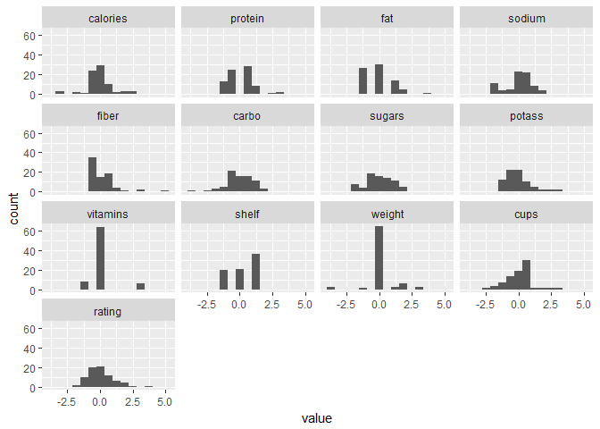
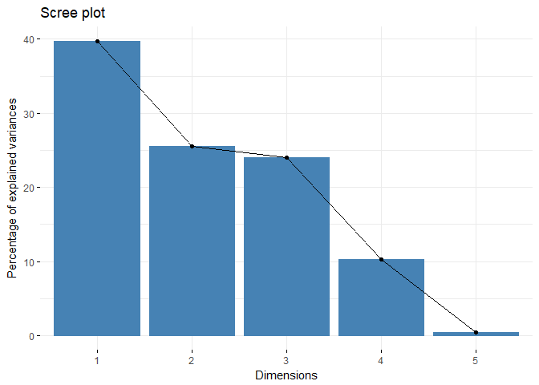
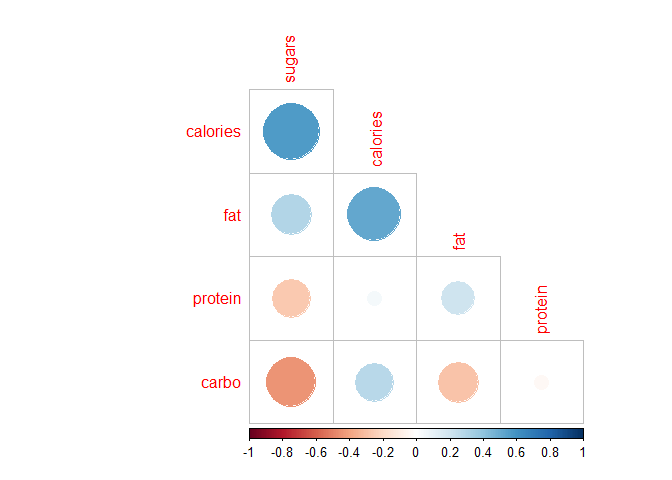
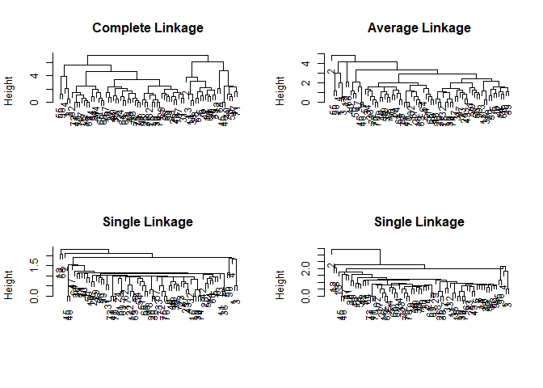

---
output:
  html_document:
    keep_md: true
---


Setting up work environment

```r
rm(list=ls())
library(tidyverse)
library(ggplot2)
library(reshape2)
library(factoextra)
library(rgl)
library(car)
library(corrplot)

#Loading Data
data <- read_csv('cereal.csv')
#Scaling data by weight
datasc <- cbind(data[,1:3],data[,4:16]*(1/data$weight))
#Normalizing data (norm(0,1))
datasc <- cbind(data[,1:3],scale(data[,4:16]))
```

Plotting histograms to explore features

```r
ggplot(melt(datasc[,4:16]),aes(x=value)) + geom_histogram(bins = 15) + facet_wrap(~variable)
```

```
## No id variables; using all as measure variables
```

<!-- -->

Keeping calories, protein, fat, carbs and sugars to explore classes,and only keeping type = cereal

```r
datasc <- datasc[datasc$type=='C',]
datasc <- datasc[,c(1,4,5,6,9,10)]

#also for data
data <- data[data$type=='C',]
```

Exploring principal components, printing Eigenvalues

```r
pr.out = prcomp(datasc[,2:6] , scale =TRUE)
fviz_eig(pr.out) #Eigenvalues
```

<!-- -->

Exploring correlations

```r
par(mfrow =c(1,1))
cormat <- round(cor(datasc[,2:6]),2)
corrplot(cormat,type = 'lower',order = 'FPC',diag = F)
```

<!-- -->

Clustering using euclidean distance as dissimilarity measure

```r
hc.complete = hclust (dist(datasc[,2:6]), method = 'complete')
hc.average = hclust (dist(datasc[,2:6]), method ='average')
hc.single = hclust (dist(datasc[,2:6]), method ='single')
hc.centroid = hclust (dist(datasc[,2:6]), method ='centroid')
```

Plotting dendograms with different linkage types

```r
par(mfrow =c(2,2))
plot(hc.complete ,main =" Complete Linkage ", xlab="", sub ="",
     cex =.9)
plot(hc.average , main =" Average Linkage ", xlab="", sub ="",
     cex =.9)
plot(hc.single , main=" Single Linkage ", xlab="", sub ="",
     cex =.9)
plot(hc.centroid , main=" Single Linkage ", xlab="", sub ="",
     cex =.9)
```

<!-- -->

Choosing complete linkage as definition of dissimilarity between groups, and a 
cut-off point with 2 groups.


```r
cutree(hc.complete, 2)
```

```
##  1  2  3  4  5  6  7  8  9 10 11 12 13 14 15 16 17 18 19 20 22 23 24 25 26 
##  1  2  1  1  2  2  1  2  1  1  2  2  2  2  1  1  1  1  1  2  1  1  1  1  1 
## 27 28 29 30 31 32 33 34 35 36 37 38 39 40 41 42 43 45 46 47 48 49 50 51 52 
##  1  2  1  1  1  1  1  1  2  2  1  1  1  2  1  2  1  2  2  2  1  1  2  1  2 
## 53 54 55 56 57 59 60 61 62 63 64 65 66 67 68 69 70 71 72 73 74 75 76 77 
##  1  1  1  1  1  1  2  1  1  1  1  1  1  1  2  1  1  2  1  1  1  1  1  1
```

Assigning classes to cereals

```r
datasc$class <- as.factor(cutree(hc.complete, 2))
data$class <- as.factor(cutree(hc.complete, 2))
```

Save names of cereals for different classes

```r
grouped_cereals <- list()
for (i in 1:length(unique(datasc$class)))
{
grouped_cereals[[i]] <- datasc$name[data$class == i]
}
grouped_cereals[[2]] #See list
```

```
##  [1] "100% Natural Bran"                     
##  [2] "Almond Delight"                        
##  [3] "Apple Cinnamon Cheerios"               
##  [4] "Basic 4"                               
##  [5] "Cap'n'Crunch"                          
##  [6] "Cheerios"                              
##  [7] "Cinnamon Toast Crunch"                 
##  [8] "Clusters"                              
##  [9] "Cracklin' Oat Bran"                    
## [10] "Fruit & Fibre Dates; Walnuts; and Oats"
## [11] "Great Grains Pecan"                    
## [12] "Honey Graham Ohs"                      
## [13] "Just Right Fruit & Nut"                
## [14] "Life"                                  
## [15] "Muesli Raisins; Dates; & Almonds"      
## [16] "Muesli Raisins; Peaches; & Pecans"     
## [17] "Mueslix Crispy Blend"                  
## [18] "Nutri-Grain Almond-Raisin"             
## [19] "Oatmeal Raisin Crisp"                  
## [20] "Raisin Nut Bran"                       
## [21] "Special K"                             
## [22] "Total Raisin Bran"
```

Plotting different classes

```r
#Plotting different classes
scatter3d(x = data$calories, y = data$rating, z = data$protein, 
          groups = data$class,surface.alpha = 0,residuals = F) 
```

```
## Loading required namespace: mgcv
```

```r
rgl.snapshot(filename = "plot2.png")

#Checking difference between two classes in terms of rating
t.test(data$rating[data$class==1],data$rating[data$class==2])
```

```
## 
## 	Welch Two Sample t-test
## 
## data:  data$rating[data$class == 1] and data$rating[data$class == 2]
## t = 3.1258, df = 62.364, p-value = 0.002692
## alternative hypothesis: true difference in means is not equal to 0
## 95 percent confidence interval:
##   3.198547 14.543015
## sample estimates:
## mean of x mean of y 
##  44.73248  35.86170
```

